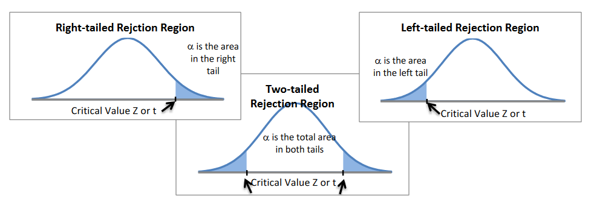
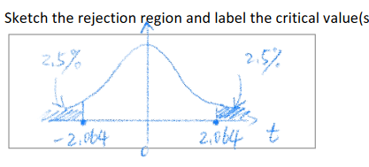
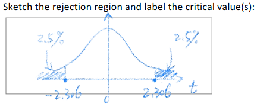
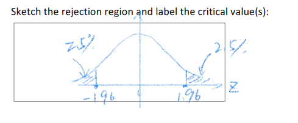

# Hypothesis testing ( one mean )

In statistics a hypothesis is a claim about a population parameter

**null hypothesis / alternative hypothesis**

Every hypothosis begins with two hypothesis the null and the alternative

    assume we are in a courtroom
    the null hypothesis is that a defendent is innocent
    the alternative is guilty

null = default

alternative = anything else

## testing claims about population proportion

Example Android devices had 87% of the market share for smartphones in 2019. In a random
sample of 1000 smartphone users in March 2020, 895 used Android devices. At a significance
level of 5%, test the claim that Android’s market share stayed the same from 2019 to 2020

1. hypothesis

    the population parameter is $p_H$
    - $P = 87\% $
    - $P \neq 87\% $

    the hypotheses are
    - $H_0 = P = 87\%$
    - $H_1 = P \neq 87\%$

2. test statistic

    $z= \frac{\hat{p}-p}{\sqrt \frac {p(1-p)}{n}}$

    $ \frac {0.895 - 0.87} {0.010635} = 2.35$

3. critical value

    $\alpha / 2 = $ critical z value

    $ 0.05/2 = 0.025$

    $ 1-0.025 = 0.975 =$ z-value

    z value $0.975 = Z 1.96$
    
     $Z_{crit} = \pm 1.96$

     Rejection region is $ {1.96} \leq  z \geq 1.96$

4. conclusion

as our data reflects a z of 2.35 which is larger than the critical value we can **reject** the hypothesis

## claims about $\mu$ with $\alpha$ unknown

Example Assume that the amount of time it takes to send a 10 Mb file across a network is
normally distributed. To test the claim that the mean length of time to transfer a 10 Mb file
across a network is 12.44 seconds, you send a 10 Mb file across a network at 20 random times,
finding a mean of 13.71 seconds and a standard deviation of 2.65 seconds. Use 𝛼 = 0.05.

1. hypothesis

    the population parameter CLAIM is $\mu = 12.44$

    the hypotheses are
    - $H_0 = \mu =12.44$
    - $H_1 - \mu \neq 12.44$

2. test statistic

    $t_{stat} = \frac {\bar {x} - \mu}{S/\sqrt n}$

    $\frac {13.71 -12.44}{2.65 / \sqrt 20}$

    $ t_{stat}\pm 2.143$

3. critical value

    we use the t table here
    calculate our df (degrees of freedom)

    $ df = n - 1$
    $ 20 -1 = 19$

    find 19 on left side of t-table

   for measuring only for increase or decrease we can look for just the $\alpha$
   but in this case we are looking at both increase and decrease so our calculation requires a two tailed graph or the equation
   
   $\alpha / 2 = $ cumulative probability

   $ df = 19$
   $cumprob = 0.025$
  
    $t_{crit} = 2.093$
4. conclusion

$t_{crit} - t_{stat} = \pm$
$2.093 - 2.143 = -0.05$
-0.05 is a negative so

**reject**

## supporting details for hypothesis testing

|statement|stats interpretation||
|--|--|--|
|less than 30% of canadians approve of stronger gun laws|$p<30\%$||
|the mean age of the full time student is 22| $\mu = 22$||
|the mean age of the part time students is atleast 31 | $\mu \geq 31$||
|the mean clay content of building site a is greater than building site b|$\mu _{A} -\mu_{B} >0$||

---
### if any claim statement involves a form of equality that claim is the null hypothesis = $\geq \leq$
**the average students age is 22** mentions EQUAL
---
### if the claim does not involve equality than the claim becomes the alternative hypothesis $\neq \lt \gt$
**less than 30% of canadians approve of stronger gun laws** mentions LESS THAN ( inequal )
---

|claim|symbolic|null/alternative|claim is ?|
|--|--|--|--|
|less than 30% of canadians approve of stronger gun laws|$p<30\%$|$\frac {H_0 p \geq 0.3}{H_1 p \gt 0.3}$| $H_1$|
|the mean age of the full time student is 22|$\mu = 22$|$\frac {H_0 p eq 22}{H_1 p \neq 22}$|$H_0$|
|the mean age of the part time students is atleast 31 | $\mu \geq 31$ |$\frac {H_0 p \geq 31}{H_1 p \lt 31}$| $H_0$|
|the mean clay content of building site a is greater than building site b|$\mu \geq 31$|$\frac {H_0 \mu _{A} - \mu _{B} \gt 0}{H_1  \mu _{A} - \mu _{B} \lt 0}$|$H_1$|

### Determining the Test Statistic and Checking the Requirements

**two types for this unit**

##### population proportion

$Z_{stat} = \frac {\hat{p}-p}{\sqrt \frac {p(1-p)}{n}}$

    $\hat{p}$ sample proportion take from an observed sample
    $p$ population proportion- hypothesized proportion in the population
    $n$ sample size

**population mean**

$t_{stat}= \frac {\bar{X}-\mu}{\frac{s}{\sqrt n}}$

    $\hat{X}$ Sample mean
    $\mu$ population mean
    $s$ sample standard deviation
    $n$ sample size

### Z stat assumption

**To assume the Z statistics are normal the following must all be true**
- the sample must be a simple random sample
- $X_1,X_2,X_3....,X_n$ are n copies of independent and identical bernoulli(p) random variable with $np \geq 5$ and $nq \geq 5$
- when there are samples from two populations the above must hold true for both

**To assume that the t-statistic really follows a t-distribution the following must all be true**
- the sample must be simple random sample
- either the original variable X is normal or $n \geq 30$
- when there are samples from two populations the above must be true for both

### Determining the Critical Value and Sketching the Rejection Region

|english|symbolic|null and alternative|tail region|
|--|--|--|--|
|less than 30% of canadians approve of stronger gun laws|$p<30\%$|$\frac {H_0 p \geq 0.3}{H_1 p \gt 0.3}$| right tailed ($H_1$ is checking to see if it is greater than $H_0$) |
|the mean age of the full time student is 22|$\mu = 22$|$\frac {H_0 p eq 22}{H_1 p \neq 22}$|right and left tails (compares vs greater and less that 22)|
|the mean age of the part time students is atleast 31 | $\mu \geq 31$ |$\frac {H_0 p \geq 31}{H_1 p \lt 31}$|left tailed (anything less than 31 is the alternative hypothosis $H_1$) |
|the mean clay content of building site a is greater than building site b|$\mu \geq 31$|$\frac {H_0 \mu _{A} - \mu _{B} \gt 0}{H_1  \mu _{A} - \mu _{B} \lt 0}$|right tailed (our $H_0$ or null hypothesis is wrong if site b has a **greater** clay content|

$\alpha$ or our significance level determines our shaded area for a rejection region 

### writing our final conclusion

the conclusion of a hypothesis must be stated in terms of the original claim the wording depends on
- is the claim the null or alternative hypothesis
- was the null rejected or not

**for null hypotheses claims**

|Decision|reject null|fail to reject null|
|--|--|--|
|Wording|"there is sufficient evidence to reject the claim that.."|"There is insufficient evidence to reject the claim that..."|

---

**for alternative hypotheses claims**

|Decision|reject null|fail to reject null|
|--|--|--|
|Wording|"there is insufficient evidence to reject the claim that.."|"There is sufficient evidence to reject the claim that..."

### type 1 and type 2 error

𝐻0: The defendant is innocent

𝐻1: The defendant is guilty

we have 4 possible outcomes
1. guilty defendant found guilt 
    - no error
2. guilty defendant found innocent
    - type 2 error wrongly released
3. innocent defendant found innocent
    - no error
4. innocent defendant found guilty
    - Type 1 error wrongly convicted

**type 1 error**
can only occur if the null hypothesis is true. if the sample data leads us to reject $H_0$ even the $H_0$ is true we have commited a type 1 error

the probability for a type 1 error is equivilant to the significance level aka $\alpha$

to reduce type 1 errors either reduce $\alpha$ or the sample size $n$

**type 2 error**
 A Type 2 error can only occur if the null hypothesis 𝐻0 is false. If the same data leads us
to fail to reject 𝑯𝟎 even though 𝑯𝟎 is false, then we have committed a Type 2 error.

the probability of this happening is called $\beta$

the formula for $\beta$ is $\beta$ = P(Fail to reject $H_0$ | $H_0$ is False)

## homework question 

25 typists are randomly selected, and the preferred keyboard height is determined for each of them. The
resulting sample average is 64.5 cm and sample standard deviation is 2.5 cm. Suppose that the population of the
preferred heights for all typists is normally distributed. At a significance level of 5%, test the claim that the
population mean of the preferred keyboard height is 66.0 cm (the recommended average keyboard height)

25 typist randomly selected
sample average preffered 64.5 cm keyboard
std if 2.5 cm
suppose preffered height is normally distributed
$\alpha{0.05}$

test the claim that the population mean of the preffered keyboard height is 66.0 cm

---
step 1 hypothesis
---

  
the population parameter is? fill in either $p$ or $\mu$  
  
 $\mu$

  
in symbolic terms the claim says   

 $\mu = 66.0$

  
the hypotheses are $H_0:$ and $H_1:$  

 $\frac{H_0 =  \mu 66.0}{H_1 = \mu \neq 66.0}$

---
step 2 test statistic  
---

  

  
the test statistic is $t_{stat}$ or $z_{stat}$   

$t_{stat}$

  
to use the $t_{stat}$ we must check the following condition(s) 
 
that the population of the preferred keyboard height is normally distributed

  
provide the formula for the test statistic-  

 $\frac{\bar{X}-\mu}{\frac{s}{\sqrt n}}$
 

  
calculate the test statistic -   

$0.12 = z = -3$

---
step 3 critical value
---

  
the rejection region is left right or doublesided -  
 
doublesided

  
the critical values/value is -   

 $z \pm 2.064 $

  
write the rejection region in the form of inequality -  
 
$t \lt -2.064 || t \gt 2.064$

  
sketch the rejection region and label the critical values   

---
step 4 Conclusion
---

  
reject or fail to reject $H_0$ -  

 **reject $H_0$** (as -3 is outside of critical value )

  
repeat the above in an english sentence -   

at x =5% we have sufficient evidence to reject the claim that the population mean of the preferred keyboard height is 66.0 cm

**Q2**

The production process for a type of engine units has been recently modified. Before the modification, the
population mean diameter was 5.350 mm. After modification, 9 units are randomly sampled. The sample mean
diameter is 5.410 mm and the sample standard deviation is 0.120 mm. It is believed that the distribution for the
diameters is normal. At a significance level of 5%, test the claim that the modification in production has changed
the population mean diameter in the manufactured units.

before mod mean diameter was 5.350

after mod sample of 9 units take

sample mean is 5.410 

std is 0.120

believed distribution is normal

significance of 0.05

Step 1 (Hypotheses):

The population parameter is _____ (fill in either 𝑝 or 𝜇).

$\mu$

In symbolic terms, the claim says _______________.

$ \mu \neq 5.350$

The hypotheses are 𝐻0: _______________ and 𝐻1: _______________.

$H_0 \mu  = 5.350$ 
$H_1 \mu  \neq 5.350$

---
Step 2 (Test Statistic):
---

The test statistic is __________ (fill in either 𝑍𝑠𝑡𝑎𝑡 or 𝑡𝑠𝑡𝑎𝑡).

$t_{stat}$

To use the test statistic, we must check the following condition(s):
__________________________________________________________.

the distribution of the  diameter is normal

Provide the formula for the test statistic: _______________.

$t_{stat} = \frac {\bar{X}-\mu}{\frac {s}{\sqrt n}}

Calculate the value of the test statistic: _______________.

$5.410-5.350 / 0.120/ \sqrt 9$
$ 1.5

---
Step 3 (Critical Value):
---

The rejection region is
_______________ (fill
in one of ‘double-
sided’, ‘left-sided’, and
‘right-sided’).

double sided

The critical value(s)
is/are __________.

$\pm 2.306$ (df = n-1) check by cumulative prob $alpha$

Write the rejection region in the form of inequality:
________________________________________.

$t \lt -2.306 || t \gt 2.306

Sketch the rejection region and label the critical value(s):

---
Step 4 (Conclusion):
---

The symbolic conclusion: ____________________ (fill in ‘reject 𝐻0‘ or ‘fail to reject 𝐻0‘).

fail to reject $H_0$

The English conclusion: _________________________________________________________
____________________________________________________________________________

as $alpha$ = 0.05 we dont have sufficient evidence to support the claim that the modification changed the population mean diameter of the units

**Q3**

In the past, the average response time to a particular editing command was 43 ms. After a new operating
system has been installed, 16 computers with the new operating system are randomly sampled. The sample
average is 40 ms and the sample standard deviation is 10 ms. Assume that the response time is normally
distributed. At a significance level of 2.5%, test the claim that the population average response time has not
been improved due to the installation of the new operating system.

old avg response 43 ms

after new installation 16 computers sampled

sample avg is 40ms 

std 10 ms

assume normally distrod

significance of 0.025

Step 1 (Hypotheses):

The population parameter is _____ (fill in either 𝑝 or 𝜇).

$\mu$

In symbolic terms, the claim says _______________.

$ \mu \neq 43ms$

The hypotheses are 𝐻0: _______________ and 𝐻1: _______________.

$H_0 \mu  \geq 43$ 
$H_1 \mu  \lt 43$

---
Step 2 (Test Statistic):
---

The test statistic is __________ (fill in either 𝑍𝑠𝑡𝑎𝑡 or 𝑡𝑠𝑡𝑎𝑡).

$t_{stat}$

To use the test statistic, we must check the following condition(s):
__________________________________________________________.

the distribution of the  response time  is normal

Provide the formula for the test statistic: _______________.

$t_{stat} = \frac {\bar{X}-\mu}{\frac {s}{\sqrt n}}

Calculate the value of the test statistic: _______________.

$$
$ -1.2

---
Step 3 (Critical Value):
---

The rejection region is
_______________ (fill
in one of ‘double-
sided’, ‘left-sided’, and
‘right-sided’).

left side 

The critical value(s)
is/are __________.

$\pm 2.131$ (df = 16-1) check by cumulative prob $alpha$

Write the rejection region in the form of inequality:
________________________________________.

$t \lt -2.131 $

Sketch the rejection region and label the critical value(s):

---
Step 4 (Conclusion):
---

The symbolic conclusion: ____________________ (fill in ‘reject 𝐻0‘ or ‘fail to reject 𝐻0‘).

fail to reject $H_0$

The English conclusion: _________________________________________________________
____________________________________________________________________________

as $alpha$ = 0.025 we dont have sufficient evidence to reject the claim that the population average response time has not been improved

Question 4
In 2019, the daily per capita water use was 398.0 liters per capita in Vancouver. In 2020, 16 residents were
sampled. The resulting sample mean of their daily per capita water use was 387.5 liters per capita and the
sample standard deviation was 14 liters per capita. Study showed that the population of daily per capita water
use was normally distributed. At a significance level of 2.5%, test the claim that the population mean of daily per
capita water use in 2020 was lower than that of 2019

claim pop mean water use in 2020 lower than 2019

2019 daily water use 398
2020 16 sampled
sample water use 387.5
std 14
siglevel 0.025

Step 1 (Hypotheses):

The population parameter is _____ (fill in either 𝑝 or 𝜇).

$\mu$

In symbolic terms, the claim says _______________.

$ \mu \lt 398$

The hypotheses are 𝐻0: _______________ and 𝐻1: _______________.

$H_0 \mu  = 398$ 
$H_1 \mu  \lt 398$

---
Step 2 (Test Statistic):
---

The test statistic is __________ (fill in either 𝑍𝑠𝑡𝑎𝑡 or 𝑡𝑠𝑡𝑎𝑡).

$t_{stat}$

To use the test statistic, we must check the following condition(s):
__________________________________________________________.

the distribution of the  daily water use was normal

Provide the formula for the test statistic: _______________.

$t_{stat} = \frac {\bar{X}-\mu}{\frac {s}{\sqrt n}}

Calculate the value of the test statistic: _______________.

$$
$ -3

---
Step 3 (Critical Value):
---

The rejection region is
_______________ (fill
in one of ‘double-
sided’, ‘left-sided’, and
‘right-sided’).

left

The critical value(s)
is/are __________.

$\pm -2.131$ (df = 16-1) check by cumulative prob $alpha$

Write the rejection region in the form of inequality:
________________________________________.

$t \lt -2.131 $

Sketch the rejection region and label the critical value(s):

---
Step 4 (Conclusion):
---

The symbolic conclusion: ____________________ (fill in ‘reject 𝐻0‘ or ‘fail to reject 𝐻0‘).

fail to reject $H_0$

The English conclusion: _________________________________________________________
____________________________________________________________________________

as $alpha$ = 0.025 we  have sufficient evidence to support the claim that the population mean of the daily per capita water use in 2020 was lower than that of 2019

Question 5
Let 𝑝 denote the proportion of BCIT computing students who are left-handed. Suppose you randomly select a
sample of 250 BCIT computing students and find that 12 are left-handed. Test the claim that 𝑝 = 0.10 at a 5%
significance level. (Wikipedia says 10% of people are left-handed.)

p = .1
$\hat{p}$ =  = 0.048

0.05 siglevel

Step 1 (Hypotheses):

The population parameter is _____ (fill in either 𝑝 or 𝜇).

$\p$

In symbolic terms, the claim says _______________.

$ p = 0.1$

The hypotheses are 𝐻0: _______________ and 𝐻1: _______________.

$H_0 p  = .1$ 
$H_1 p  \neq .1$

---
Step 2 (Test Statistic):
---

The test statistic is __________ (fill in either 𝑍𝑠𝑡𝑎𝑡 or 𝑡𝑠𝑡𝑎𝑡).

$z_{stat}$

To use the test statistic, we must check the following condition(s):
__________________________________________________________.

$np=250 *.1 = 25 \geq 4 and nq = 250 * .9 - 225 \geq 5

Provide the formula for the test statistic: _______________.

$Z_{stat} = \frac {\hat{p}-p}{\frac \sqrt {p(1-p)}{n}}$

Calculate the value of the test statistic: _______________.

$$
$ -2.74

---
Step 3 (Critical Value):
---

The rejection region is
_______________ (fill
in one of ‘double-
sided’, ‘left-sided’, and
‘right-sided’).

double

The critical value(s)
is/are __________.

$\pm $ 0.05 / 2 - 0,025 = z \pm 1.96$ check by cumulative prob $alpha$

Write the rejection region in the form of inequality:
________________________________________.

$t \lt -1.96 || t \gt 1.96 $

Sketch the rejection region and label the critical value(s):

---
Step 4 (Conclusion):
---

The symbolic conclusion: ____________________ (fill in ‘reject 𝐻0‘ or ‘fail to reject 𝐻0‘).

reject $H_0$

The English conclusion: _________________________________________________________
____________________________________________________________________________

as $alpha$ = 0.05 we have enough evidence to reject the claim that left handed proportion among bcit students is 10%

